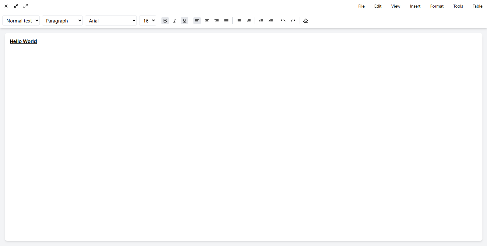

# Wordless Editor

A sophisticated rich text editor built with React, featuring a modern interface and powerful editing capabilities.



## Features

### Core Editing
- Rich text formatting (bold, italic, underline)
- Multiple heading levels (H1-H6)
- Custom block elements (quotes, code blocks)
- Nested lists with custom indentation
- Text alignment options
- Font family and size selection

### Smart Interactions
- Floating formatting toolbar on text selection
- @mention system with fuzzy search
- Keyboard shortcuts for common operations
- Undo/redo functionality with state preservation

### Technical Highlights
- Built with React and TypeScript
- State management using Zustand
- Styling with Tailwind CSS
- Offline support with localStorage persistence
- Modular component architecture

## Getting Started

### Prerequisites
- Node.js 14.0 or higher
- npm or yarn package manager

### Installation

1. Clone the repository
```bash
git clone https://github.com/yourusername/wordless.git
cd wordless
```

2. Install dependencies
```bash
npm install
```

3. Start the development server
```bash
npm run dev
```

## Usage

### Basic Formatting
- Use the toolbar buttons for basic formatting
- Select text to reveal the floating toolbar
- Use keyboard shortcuts for common operations

### Keyboard Shortcuts
- Bold: Ctrl/Cmd + B
- Italic: Ctrl/Cmd + I
- Underline: Ctrl/Cmd + U
- Undo: Ctrl/Cmd + Z
- Redo: Ctrl/Cmd + Shift + Z

### @Mentions
1. Type '@' followed by a name
2. Use arrow keys to navigate suggestions
3. Press Enter to select a user
4. Press Escape to dismiss suggestions

### Block Elements
- Use the block type dropdown to create:
  - Paragraphs
  - Block quotes
  - Code blocks
  - Custom blocks

## Architecture

### Component Structure
- Editor: Main component handling the editor interface
- FloatingToolbar: Context-sensitive formatting toolbar
- MentionDropdown: User mention suggestion system

### State Management
- Zustand store for global state
- Local state for UI components
- Persistent storage for offline support

### Styling
- Tailwind CSS for utility-first styling
- Custom CSS for specific components
- Responsive design principles

## Performance

### Optimization Techniques
- Efficient state updates
- Debounced content saving
- Lazy loading of components
- Limited history stack (50 states)

### Browser Support
- Chrome (latest)
- Firefox (latest)
- Safari (latest)
- Edge (latest)

## Development

### Project Structure
```
src/
  editor/
    components/
      Editor.tsx
      FloatingToolbar.tsx
      MentionDropdown.tsx
    store/
      editorStore.ts
  App.tsx
  main.tsx
```

### Build
```bash
npm run build
```

### Testing
```bash
npm run test
```

## Contributing

1. Fork the repository
2. Create a feature branch
3. Commit your changes
4. Push to the branch
5. Open a pull request

## License

This project is licensed under the MIT License - see the LICENSE file for details.

## Acknowledgments

- Built with React
- Icons by Lucide
- Fuzzy search by Fuse.js
- State management by Zustand
